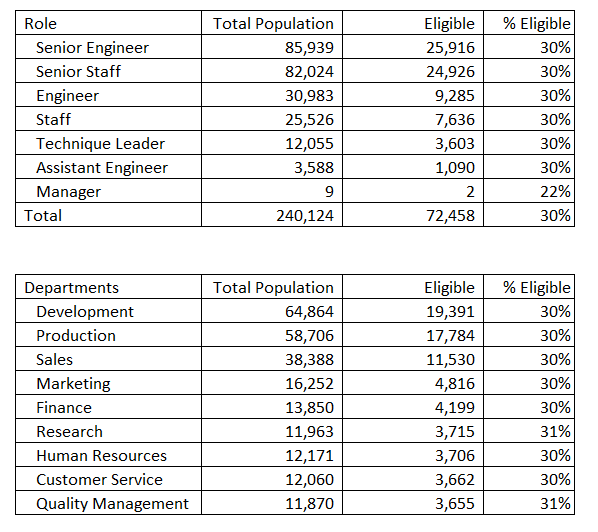
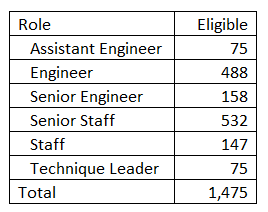

# Pewlett-Hackard-Analysis
## Overview
Pewlett-Hackard is a mature company with approximately 240,000 employees.  Many of these employees have been with the company for an extended period of time.  

The company is expecting a "silver tsunami" of retirements and would like to get ahead of the potential churn of employees.  

They have asked for an analysis around employees who are getting close to retirement along with a list of employees who would be eligible for a mentorship program that would potentially allow the participants to move into new roles within the company. 

We were tasked with determining the following:
1. Number of retiring employees by title.
2. Identify employees who are eligible to participate in a mentorship program.

## Results
### Number of retiring employees by title
* Aproximatly 72,000 employees expected to retire, or 30% of the workforce 
    - Development
    - Production
    - Sales
* Aproximatly 48,000, or 20% of the potential retirees are from two roles, Senior Engineer and Senior Staff.
* There are two managers that are eligible.
* The query for this was a bit flawed.  Upon reviewing the data, it was discovered that the original 300,000 employees are no longer employeed with Pewlett-Hackard.

### Employees eligible for the mentorship program
* There are only 1,475 existing emplyees that are eligible for the program, or 2% of the eligible retirees.
*The mentorship query for this analysis was also a bit flawed as it did not accomodate for employees that are no longer with the company.

## Summary
There is a large portion of the company that is eligible to retire and it seems that there has been little planning up to this point.  It is recommend that the company research ways to recruit new talent or outsorce some of the taskes currently completed in house.